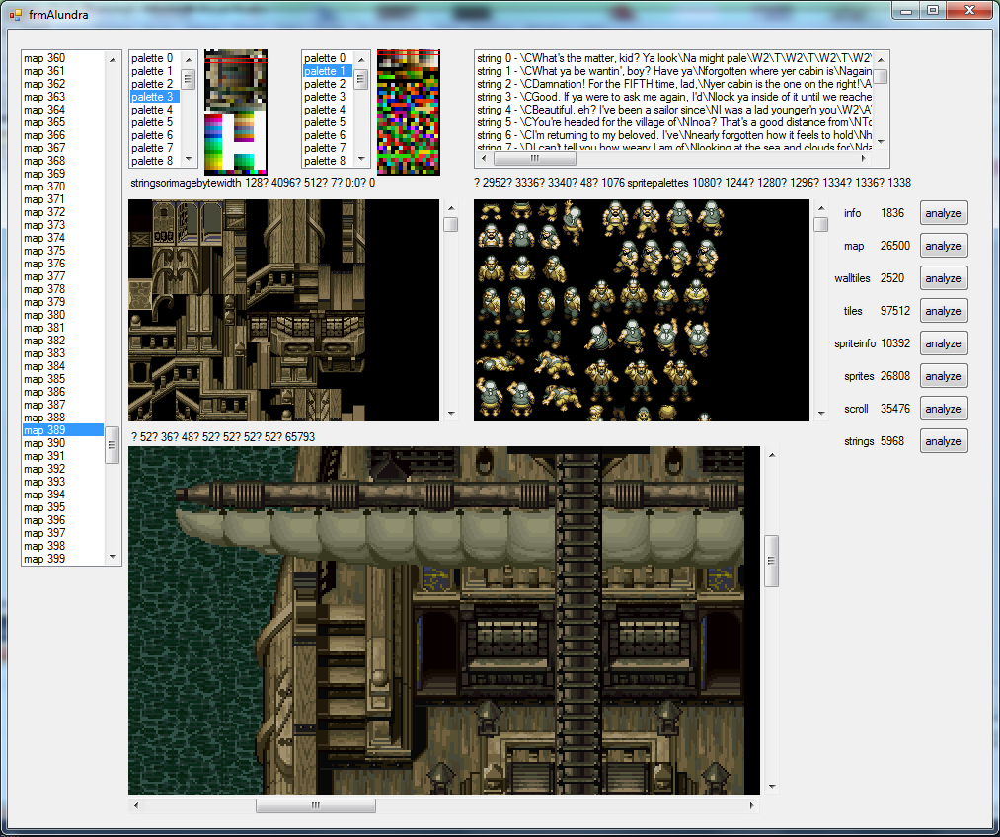
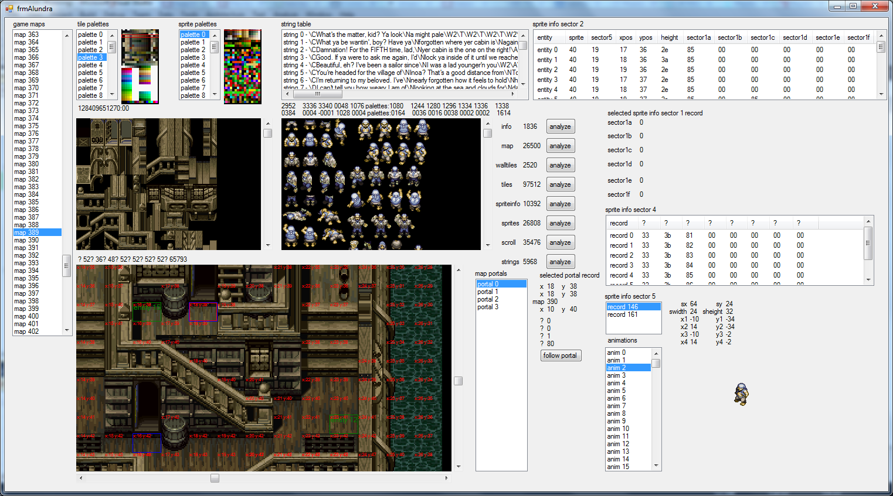
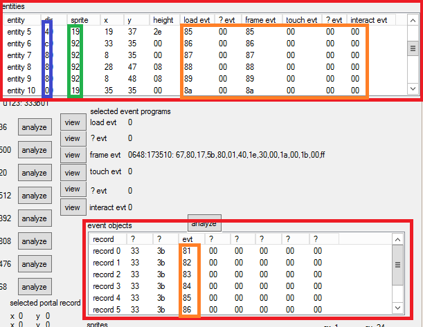
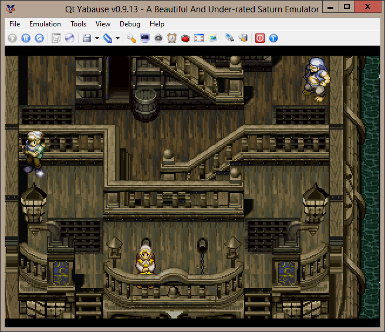

# Alundra Sega Port/Clone Fan Effort

In July 17, 2014 user named "surixurient" in segaextreme.net online bulletin board, [started a thread named "Alundra port/clone"](https://segaxtreme.net/threads/alundra-port-clone.23798/) stating that they were in the process of "working on the beginnings of an Alundra engine for saturn".

User surixurient had previously made an Alundra-like engine for Windows PC, [sharing their progress on Youtube](https://www.youtube.com/watch?v=5lzmay8j2PQ), but shared their interest of taking advantage of the original game's "original content, in their original format" in the making of the port/clone for Sega Saturn system.

## DATAS.BIN Bytecode

User surixurient had discovered that Alundra's original disc image had a big file called "DATAS.BIN", in which they described to contain "maps, tilesets, sprites,events, string tables" among various other things, indicating that most of the game's assets were written in this specific file alone. Surixurient first expressed their difficulties about interpreting the bytecode when attempting to figure out various parts of the script, most notably sprite bitmaps, and game event logic, but was quick to give on update whenever they succeeded to get unstuck on specific parts of the code.

## Surixurient's Tools

#### NOTE: The images below are no longer reachable as they were presented in segaextreme's website, but were able to be scavanged using [Internet Archive's Wayback Machine](https://web.archive.org/)

|  |
| :-------------------------------------------------------------------------------------------------------------------: |
|     "frmAlundra" - Surixurien't tool most likely used to aid in interpreting the game's event logic and graphics      |

Surixurient shared various screenshots throughout the thread of their tooling used to make sense of the assets. The program was titled as "frmAlundra" in which there were multiple layouts presenting assets such as tilemaps, sprites, game dialogue, events and their metadata.

|  |
| :-----------------------------------------------------------------------------------------------------: |
|            "frmAlundra" - Showcasing various layouts for presenting graphics and game logic             |

|  |
| :-----------------------------------------------------------------------------------------------: |
|      Surixurient's program that represents the game's entities, events and their parameters       |

## Sega Saturn Renderer and a Likely Discontinuation

|  |
| :--------------------------------------------: |
|              Sega Saturn renderer              |

In August 12, 2014 surixurient shared a screenshot of their Sega Saturn renderer and told that they had difficulty in attempting to fit the graphics in Saturn's video memory.

About 5 months after surixurient shared an update on the bulletin board stating that they were back on working on the project after getting sidetracked. Surixurient has not sent another message since January 7, 2015 and the community considers Surixurient to have abandoned the project entirely as no news have surfaced since.
